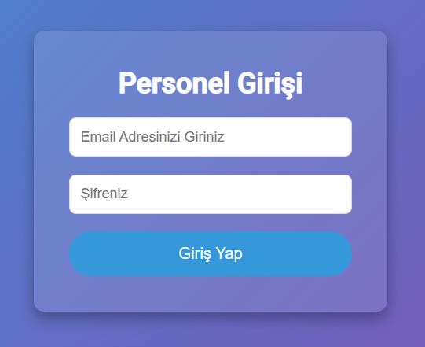
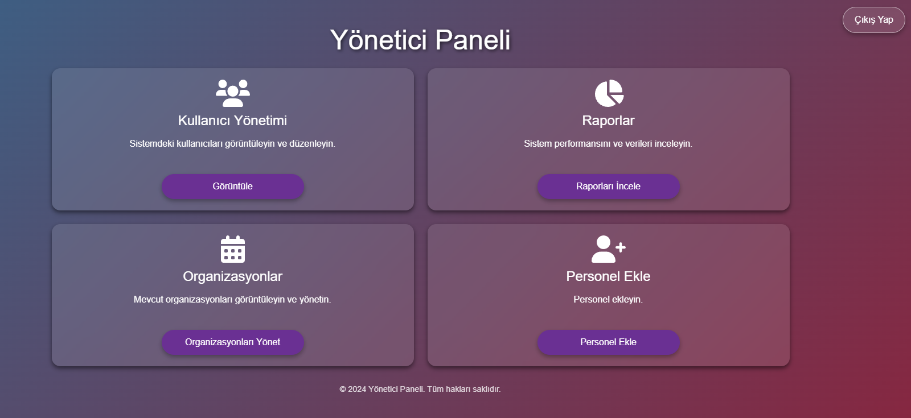
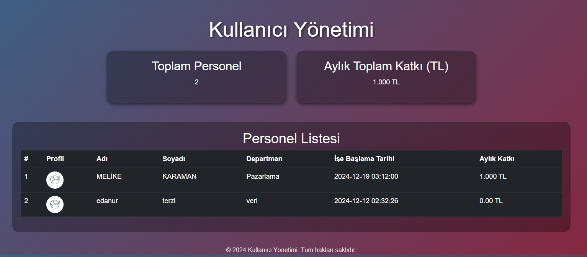
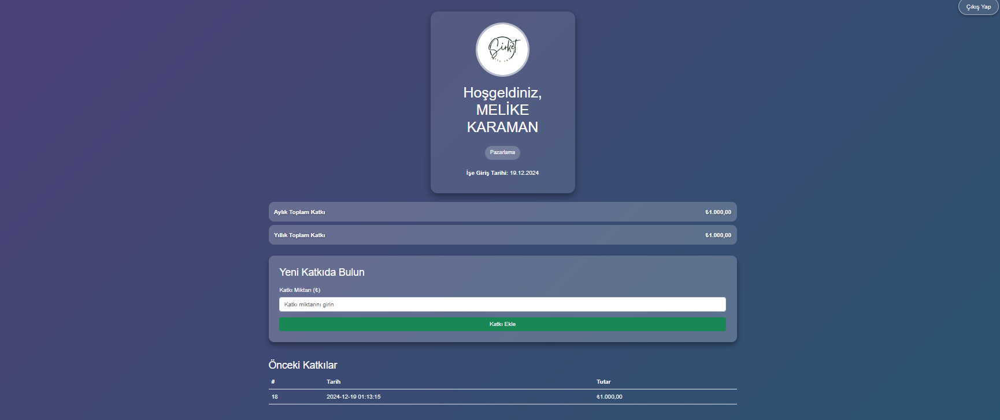
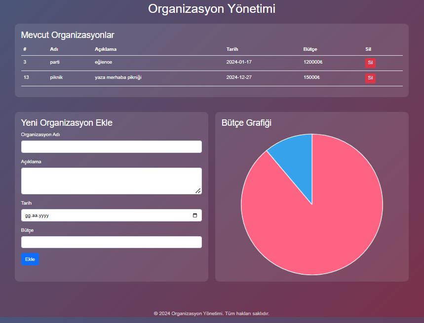
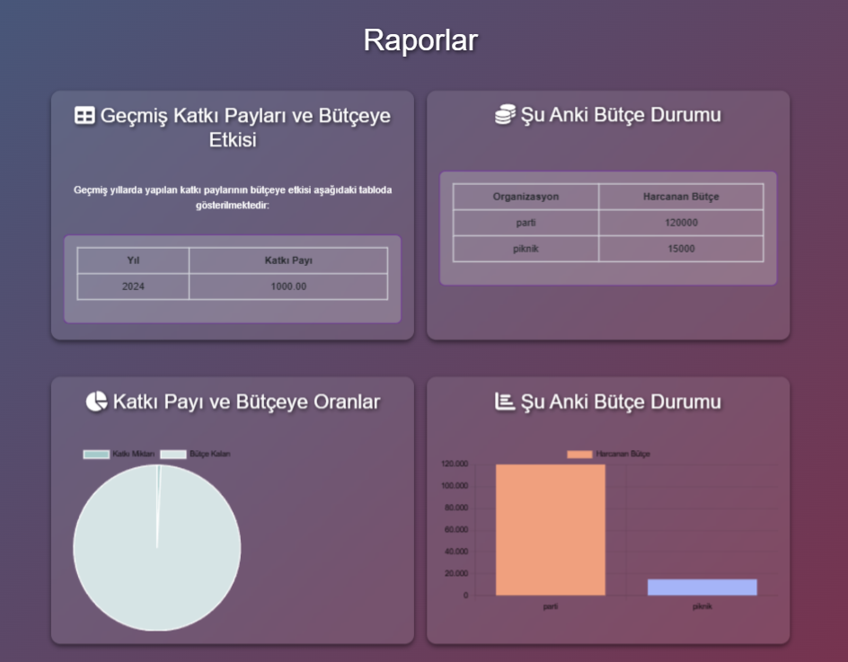

# Hesap Yönetimi Sistemi

> 💡 **İş Analizi ve Sistem Dokümantasyonu**
> Bu proje yalnızca bir kodlama çalışması değil; kapsamlı bir sistem analizi, gereksinim çıkarma ve proje yönetimi sürecinin ürünüdür. Projenin kullanıcı senaryoları (Use-Case), risk analizi, bütçe yönetimi işleyişi ve tüm tasarım aşamaları detaylı olarak raporlanmıştır.
> 
> 📄 **Detaylı Proje Raporuna Buradan Ulaşabilirsiniz:**
> 📂 [`/docs/proje_raporu_Rapor.pdf`](docs/proje_raporu.pdf)

---

## Proje Hakkında

Hesap Yönetimi Sistemi, işletmelerin çalışan katkı paylarını ve organizasyon bütçelerini dijital ortamda takip edebilmesini sağlayan web tabanlı bir yönetim sistemidir.

Proje, KTÜ Yönetim Bilişim Sistemleri bölümü **E-İşletmecilik dersi** kapsamında geliştirilmiştir.

Sistem ile birlikte işletmeler;
- Çalışan kayıtlarını yönetebilir,
- Çalışan katkı paylarını takip edebilir,
- Organizasyon bütçelerini kontrol edebilir,
- Katkı ve bütçe verilerini raporlayabilir,
- Kullanıcılara otomatik e-posta bildirimleri gönderebilir.

Proje geliştirilirken kullanıcı ihtiyaçları analiz edilmiş, sistem gereksinimleri belirlenmiş, veri tabanı tasarımı yapılmış ve kullanıcı senaryoları oluşturularak geliştirme süreci yürütülmüştür.

## Proje Amacı

İşletmelerde manuel olarak takip edilen katkı payı ve bütçe yönetimi süreçlerini daha düzenli, erişilebilir ve takip edilebilir hale getirmek amaçlanmıştır.

Sistem sayesinde yöneticiler;
- Çalışan katkı durumlarını,
- Toplam bütçe bilgisini,
- Organizasyonlara özel bütçe tanımlamalarını,
- Geçmiş işlem kayıtlarını
tek bir platform üzerinden yönetebilmektedir.

# Temel Özellikler

## Kullanıcı Yönetimi
- Yönetici tarafından yeni çalışan ekleme
- Çalışan bilgilerinin sistemde tutulması
- Kullanıcı yetkilendirme yapısı
- Kullanıcı bilgilerinin görüntülenmesi

## Katkı Payı Yönetimi
- Çalışanların aylık katkı payı girişi
- Kişisel katkı geçmişinin görüntülenmesi
- Toplam katkı miktarının hesaplanması
- Katkı işlemi sonrası otomatik e-posta bildirimi

## Organizasyon ve Bütçe Yönetimi
- Yeni organizasyon oluşturma
- Organizasyonlara özel bütçe tanımlama
- Güncel bütçe durumunun takip edilmesi

## Raporlama ve Görselleştirme
Sistem içerisinde katkı ve bütçe verilerinin daha anlaşılır şekilde takip edilebilmesi için grafik ve tablo tabanlı raporlama ekranları oluşturulmuştur.

Kullanılan görselleştirme örnekleri:
- Pasta grafikler
- Çubuk grafikler
- Bütçe durum tabloları

## E-Posta Bildirimleri
SMTP entegrasyonu kullanılarak;
- Katkı ödemesi sonrası makbuz gönderimi
- Yeni kullanıcı oluşturulduğunda şifre bilgilendirmesi
otomatik olarak gerçekleştirilmektedir.

# Kullanılan Teknolojiler

| Kategori | Teknolojiler |
|----------|--------------|
| Backend | PHP |
| Frontend | HTML, CSS |
| Veritabanı | MySQL |
| Veritabanı Yönetimi | Medoo PHP Database Framework |
| E-posta Entegrasyonu | SMTP |
| Sunucu Ortamı | Apache Web Server |

# Sistem Mimarisi

Sistem temel olarak üç ana bileşenden oluşmaktadır:

### Kullanıcı Paneli
Çalışanların;
- Katkı payı ekleme,
- Geçmiş katkılarını görüntüleme,
- Hesap bilgilerine erişme
işlemlerini gerçekleştirdiği bölümdür.

### Yönetici Paneli
Yöneticilerin;
- Kullanıcı yönetimi,
- Organizasyon ve bütçe yönetimi,
- Raporlama
işlemlerini gerçekleştirdiği bölümdür.

### Veri Tabanı Katmanı
Sistem içerisinde;
- Kullanıcı bilgileri,
- Katkı kayıtları,
- Organizasyon ve bütçe bilgileri,
- Yetkilendirme verileri
ilişkisel veri tabanı yapısı ile yönetilmektedir.

# Veri Tabanı Tasarımı

Sistemde temel olarak aşağıdaki 4 veri tablosu bulunmaktadır:

- **Personeller** (Kullanıcı bilgileri)
- **Katkılar** (Katkı payı kayıtları)
- **Organizasyonlar** (Organizasyon detayları ve bütçe takibi)
- **Yetkili** (Yönetici yetkilendirme bilgileri)

Veriler arasındaki ilişkiler kullanılarak kullanıcı bazlı katkı takibi ve organizasyon bazlı bütçe yönetimi sağlanmıştır.

# Proje Süreci

Proje geliştirme sürecinde;
1. Gereksinim analizi gerçekleştirildi.
2. Kullanıcı senaryoları oluşturuldu.
3. Veri tabanı tasarımı yapıldı.
4. Arayüz tasarımları hazırlandı.
5. Backend ve veri tabanı işlemleri geliştirildi.
6. Sistem testleri gerçekleştirilerek gerekli iyileştirmeler yapıldı.

# Takım Çalışması

Proje, 5 kişilik ekip çalışması olarak geliştirilmiştir.
Ekip içerisinde; Proje planlama, Veri tabanı yapılandırma, Arayüz geliştirme, Backend geliştirme ve Test süreçleri alanlarında görev paylaşımı yapılarak ilerlenmiştir.

# Proje Sürecindeki Rolüm

Proje geliştirme sürecinde **veri tabanı yapılandırma** ve **sistem test** aşamalarında görev aldım.

Sorumluluklarım kapsamında;
- Veri tabanı yapılandırma süreçlerinde görev aldım.
- Sistem içerisindeki veri yapılarının oluşturulmasına destek verdim.
- Son testler ve kontroller aşamasında görev aldım.
- Sistem gereksinimleri ve kullanıcı senaryolarının değerlendirilmesine katkı sağladım.

# Kazanımlar

Bu proje ile birlikte;
- İşletme süreçlerinin analiz edilmesi,
- Gereksinim belirleme,
- Veri tabanı tasarımı,
- Web tabanlı sistem geliştirme,
- Takım içerisinde proje yönetimi
konularında deneyim kazanılmıştır.

# Ekran Görüntüleri

## Personel Giriş Ekranı

## Yönetici Paneli

## Kullanıcı Yönetimi

## Katkı Ekleme Ekranı

## Organizasyon Yönetimi

## Raporlama Ekranı

# Geliştiriciler
- Kübra Bayburtlı
- Melike Karaman
- Edanur Terzi
- Metehan Ünal
- Emre Yayla

# Lisans
Bu proje eğitim amacıyla geliştirilmiştir.
